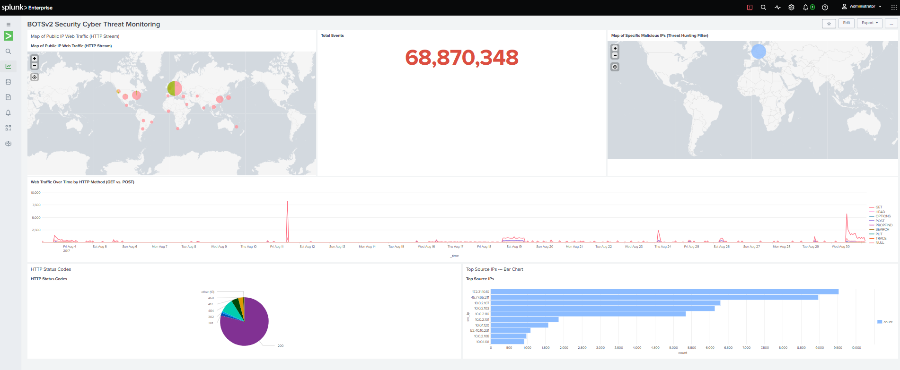

<!-- Replace bracketed placeholders with your real details before publishing. -->

# CASE-001 · SIEM Threat Detection & Dashboard Build

`Status: Documented` · `Category: Detection & Monitoring` · `Tools: Splunk Enterprise, BOTSv2 Dataset, SPL`

## Overview

This case covers standing up a working SIEM environment and learning to turn raw security logs into actionable monitoring. The lab uses **BOTSv2 (Boss of the SOC v2)** — a publicly available dataset built by Splunk for SOC training, containing logs from a simulated breach against a fictional brewing company ("Frothly"). It includes a mix of Windows event logs, network/wire data, and endpoint telemetry, which makes it realistic enough to practice real detection workflows on.

## Lab Environment

| Component | Detail |
|---|---|
| SIEM Platform | Splunk Enterprise [version] |
| Dataset | BOTSv2 |
| Indexes Used | `[index names, e.g., botsv2]` |
| Key Sourcetypes | `[e.g., WinEventLog:Security, stream:http, suricata]` |
| Deployment | [Single instance on local VM / Docker / etc.] |

## Methodology

1. **Ingest & orient** — loaded the BOTSv2 dataset into Splunk and ran broad searches (`index=botsv2`) to understand what sourcetypes and fields were available before writing any targeted queries.
2. **Hunt with SPL** — wrote searches to surface indicators of compromise across the simulated environment.
3. **Build dashboards** — translated the most useful searches into permanent dashboard panels: time charts for activity volume, tables for top talkers/users, and single-value panels for at-a-glance health checks.
4. **Rehearse the demo** — practiced presenting the dashboard live, narrating what each panel shows and why it matters to someone without a security background.

## Key SPL Queries

> Replace these with your actual queries and a one-line note on what each one is hunting for.

```spl
# [Describe what this search detects]
index=botsv2 sourcetype=[sourcetype]
| stats count by [field]
| sort -count

# [Describe what this search detects]
index=botsv2 [search terms]
| timechart span=1h count by [field]
```

## Findings

- Total Events: A massive volume of 68,870,348 total events are being processed, indicating high-density log collection across the environment.
- Map of Public IP Web Traffic: Public web traffic is distributed globally, with the largest concentration of activity originating from Europe, followed by clusters in North America and parts of Asia.
- Map of Specific Malicious IPs: The threat-hunting filter successfully isolates suspicious activity to a single localized geographic region in Northern Europe/Scandinavia.
- Web Traffic Over Time by HTTP Method: Traffic is predominantly driven by standard GET requests, but it experiences two distinct anomaly spikes—a sharp, sudden spike around August 11 and a more sustained, aggressive surge around August 30.
- HTTP Status Codes: The overwhelming majority of requests resulted in successful 200 OK responses, though a small sliver of error and redirect codes (301, 302, 404, 412, 468) are present.
- Top Source IPs Bar Chart: Two dominant IP addresses (172.31.10.10 and 45.77.65.211) are driving the highest traffic volume, each responsible for approximately 9,500 events, making them the primary subjects for further investigation.

## Dashboard


*This is a Splunk Enterprise security dashboard titled "BOTSv2 Security Cyber Threat Monitoring" that visualizes nearly 69 million security events from the BOTS v2 dataset to analyze the geographical origins, timeline spikes, and top source IPs of external web traffic and cyber attacks.*

## Skills Demonstrated

- SPL query writing (search, stats, timechart, eval)
- Log correlation across multiple sourcetypes
- Dashboard and visualization design
- Translating technical findings for a non-technical audience

## Reflection

Project Reflection: BOTSv2 Security Threat Monitoring Dashboard
This project successfully transformed nearly 69 million raw log events from the BOTS v2 dataset into a centralized, actionable security intelligence dashboard. By designing and implementing tailored SPL queries across multiple data sources—including HTTP streams, network traffic, and threat intelligence filters—the dashboard effectively bridges the gap between geographic visibility and chronological behavioral analysis.

Key Achievements & Insights:

- Geospatial & Trend Alignment: Integrating geostats cluster maps alongside timechart visualizations made it possible to instantly correlate where traffic originates with when anomalous spikes occur. The high-volume spikes detected on August 11 and August 30 serve as prime examples of how automated adversarial behavior shifts over time.

- Targeted Threat Isolation: The implementation of specific threat-hunting filters successfully isolated high-risk indicators, pinpointing malicious traffic (such as the scanning activity from 45.77.65.211) down to specific geographic regions and tracking its operational volume against baseline internal traffic (172.31.10.10).

- Operational Readiness: Visualizing tactical data points like HTTP status code distributions and top-talking source IPs provides a comprehensive security posture overview. This layout significantly reduces the time to detect and triage potential web application scans, brute-force attempts, or data exfiltration events.

Ultimately, this project highlights the power of Splunk Enterprise in processing massive datasets to deliver clear, scannable, and actionable insights. It provides analysts with a dual-lens capability—simultaneously tracking high-level global trends and granular, entity-specific malicious behavior on a single pane of glass.
